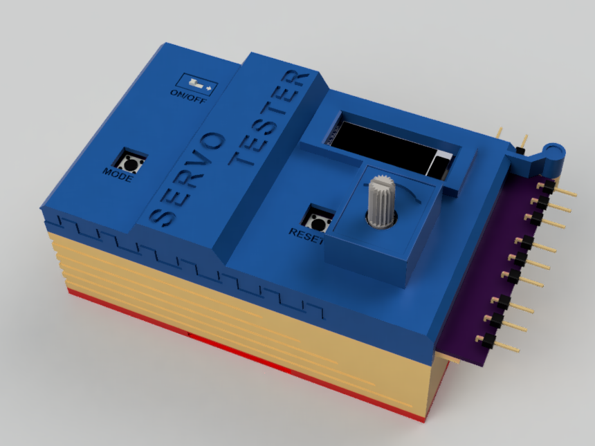
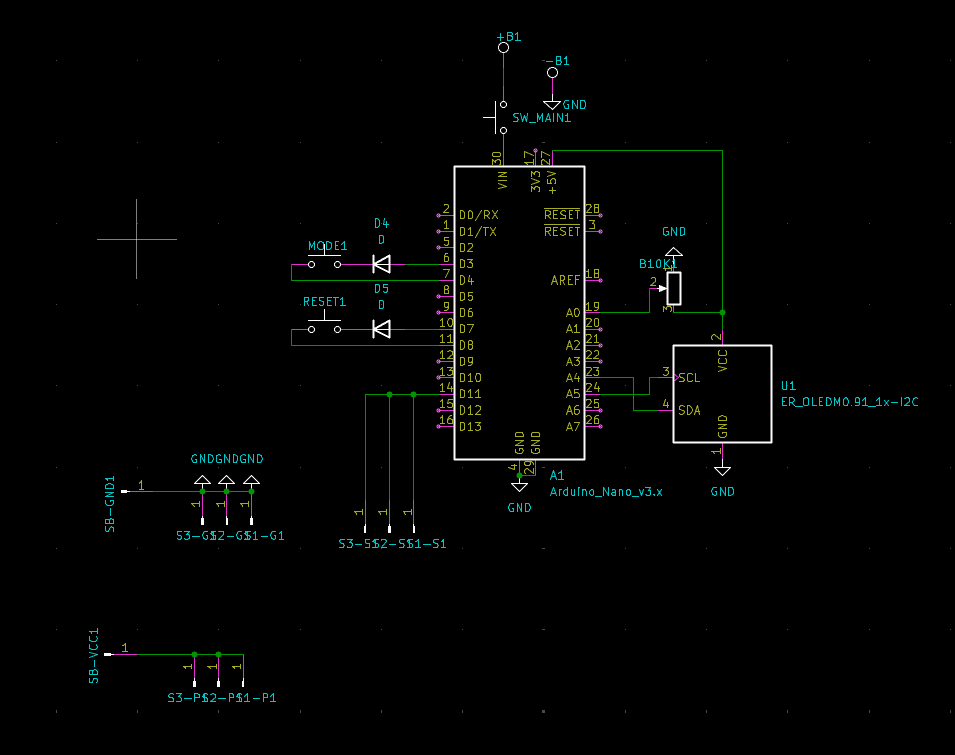
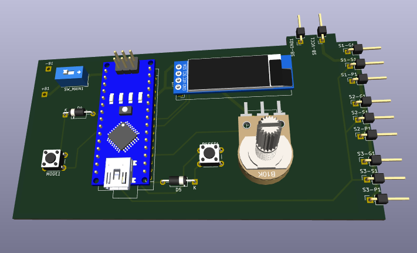

# SERVO TESTER

A servo tester is basically a device someone can use to check whether their servo motors work or not and this can be very essential as it can help you to check your servo motors before having to write new code just to run a single servo.
Most of the servo need 1ms to 2ms pulse so that it moves from 0 to 180 degrees respectively.

Here is a normal view of servo tester:

Exploded View:

## WORKING / SCHEMATIC

The main component here is Arduino Nano I chose this specially because this servo tester also has a 0.91 inch display module.
The display shows stats like speed, angle, mode, etc.
It also feature a potentiometer to control different things based on the mode selected
It also has two buttons one is for resetting to original position and other is for switching between sweep and manual mode.

### The servo tester has 4 modes which are:
- Manual Mode : As the name suggests here you control the servo manually by using the potentiometer. In this potentiometer controls the position of servo.
- Sweep : In this the servo moves from the minimum position to maximum position it can attain between 1ms to 2ms pulses which in most cases is between 0 to 180 degrees. In this the potentiometer controls the speed of sweep of servo.
- Calibration : I added this mode because if someone chose to have a different kind of potentiometer then the readings may become incorrect, which is why in calibration mode you can make your servo tester adapt to your potentiometer. In this the potentiometer is used for setting the maximum and minimum position.
It can be selected by pressing the two buttons simultaneously.
- RESET : In this the servo moves to the initial position and stays like that.

## Bill of Materials

| Component | Quantity | 
|-----------|----------|
| Arduino Nano | 1 |
| Arduino Data Cable | 1 |
| 0.91" OLED Display Module | 1 |
| Push Button | 2 |
| Toggle Switch | 1 |
| PCB | 1 |
| Male connector pins | 11 |
| Top enclosure | 1 |
| Middle Enclosure | 1 |
| Bottom Panel | 1 |
| 6-12V DC Power Source | 1 |
| Servo Motor (SG90) | 1 |
| 4x1.5mm magnets | 2 |

## Wiring / Schematic
An overview of what the PCB is like.

Circuit:

PCB:

PCB 3D Model:
